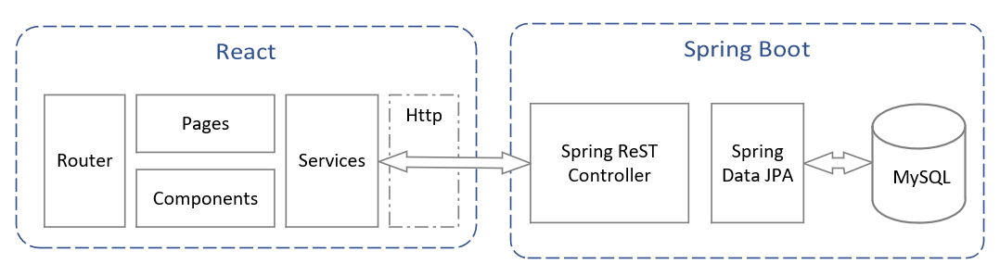
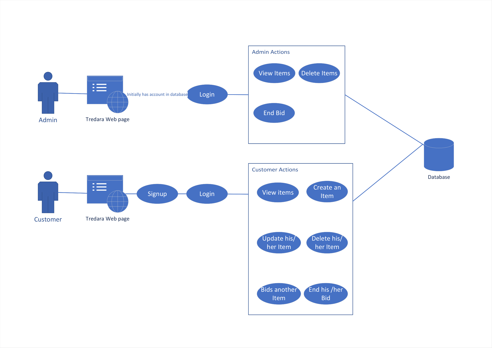
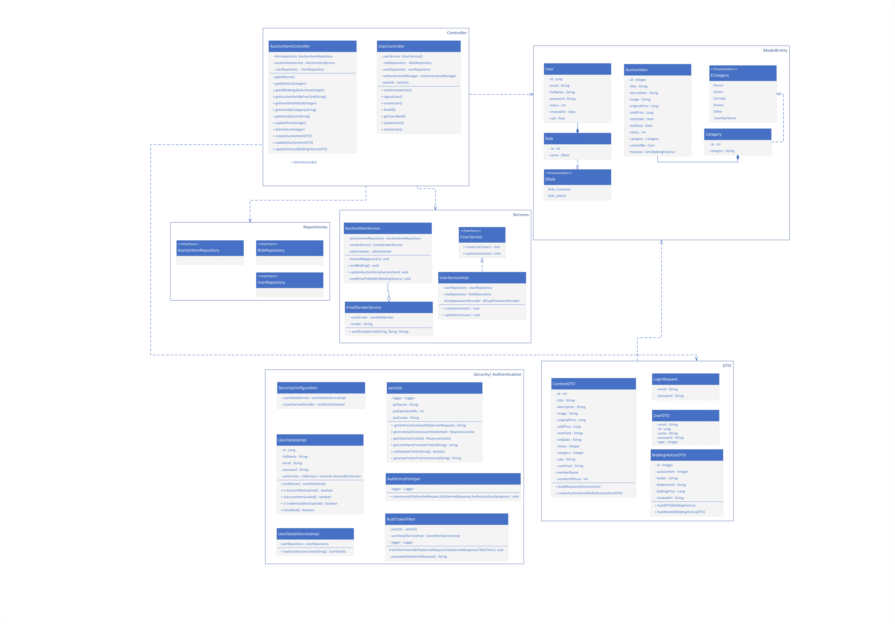
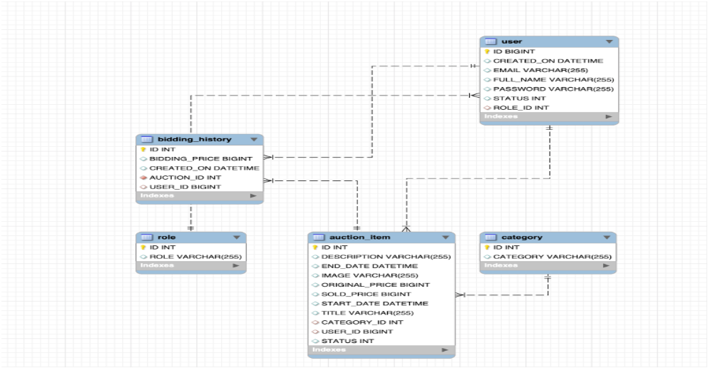

# Tredara

Tredara application wants to revolutionize the secondhand market by bringing it to the internet.It was designed to sell
items through bidding so that the customer who bid more up to the end date will get the product.

## Setup

#### Prerequisites

Check the following links for documentation and guides:

- [Maven](https://maven.apache.org/)
- [Spring](https://spring.io/projects/spring-boot)
- [Docker](https://www.docker.com/)
- [NPM](https://docs.npmjs.com/about-npm)
- [React](https://docs.retool.com/docs)
- [Mysql](https://www.mysql.com/downloads/)
- [Postman](https://www.postman.com/downloads/)

#### Build and Generate the JAR file (compile the source code)

```
# Git clone (download the soruce code)
$ git clone https://github.com/novare-tredara/Tredara

# Project structure
.
├── ...
    ├──tredara-backend/
         ├──src
         ├──pom.xml
    ├──tredara-frontend/
         ├──src
         ├──package.json
    ├──sql
    ├──logs
    ├──design/
    ├──docker-compose.yml
    ├──Dockerfile.backend
    ├──Dockerfile.frontend
    ├──README.md

$ cd Tredara
```

```
# Backend Application: Build and Run the JAR file (compile the source code)
$ cd tredara-backend
$ mvn clean package -DskipTests=true
$ java -jar "-Dspring.profiles.active=prod" target/tredara-backend-0.0.1.jar

# Frontenf Application : Install and run 
$ cd tredara-frontend
$ npm install
$ npm run start

NOTE:
Without Docker env: Change"proxy": "http://localhost:8080/api/" in package.json file
```

#### How to run and build in Docker

```
$ cd Tredara
$ docker compose up --build --force-recreate
```

#### How to Setup and Access the Database, Backend and Frontend application

Note: Docker container setup the database enviroenment default data using sql/init.sql file.

- Database:
    - User     : root
    - Password : root
    - Database Schema: tredara
    - Port : 3306
    - Initial Database schema: sql/init.sql
- Backend:
    - Profiles : prod (production environemnt) and dev (used during the development phase)
    - Server Port: 8080
    - Server Address : localhost
- Frontend:
    - Port: 3000
    - Address: localhost

Tredara Web application URL: http://localhost:3000/<br>

In order to access the admin section here are credentials:

- email : admin@tredara.com
- password :12345

## Implementation and Design

1. TypeScript – Coding language for implementing the Frontend application.
2. React -Framework for building the Graphical User Interface.
3. Eclipse/Intellij Idea – IDE for developing backend development.
4. Spring boot- Open Source Framework in Java.
5. Visual Studio - IDE used for developing Frontend development.
6. Postman- Postman is an API platform to design, build, test and iterate API’s.
7. Figma - Design tool to design a website how the website looks.
8. Microsoft word – Document preparation.

[Link for Design and documentation](https://docs.google.com/document/d/14i90zX6gmQh2WMupiTy1bymrvfY2LhsFNgJH3Z4uu6Y/edit#)

## Architectural Diagram

Spring boot MVC shall be used in designing the Natflix application, see below:


Architecture flow of Sprint boot application and React Web application.


## Usecase Diagram

A low detail diagram to visualize how the application will work.


## Class Diagram

The class diagram allows to visualize the overall hierarchy of the project.


## Model Diagram
The model diagram represents the abstract view of the system. ER diagram stands for Entity Relationship Diagram.

