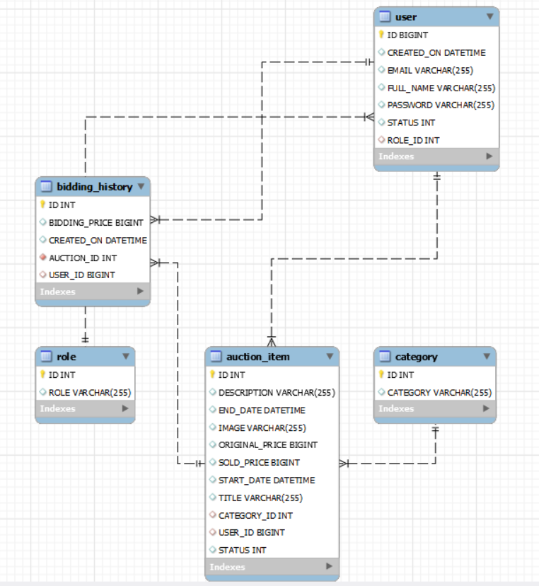

# Tredara

## About
Tredara application wants to revolutionize the secondhand market by bringing it to the internet.It was designed to sell
items through bidding so that the customer who bid more up to the end date will get the product.In this Project,we have two users.

1.Admin

The Admin have the option to view all the items of customers.he shall have the option to delete any item.He cant bid for any item.He shall end the bid only.

2.Customer
The Customer have the following option:

1. Create an item

2. Update an item

3. Delete an item

4. End Bid


## Setup

#### Prerequisites

Check the following links for documentation and guides:

[](https://maven.apache.org/)
[](https://spring.io/projects/spring-boot)
[](https://www.docker.com)
[](https://docs.npmjs.com/about-npm)
[](https://reactjs.org/)
[](https://www.mysql.com/downloads/)
[](https://www.postman.com/downloads/)
[](https://www.typescriptlang.org/)

#### Build and Generate the JAR file (compile the source code)

```
# Git clone (download the source code)
$ git clone https://github.com/novare-tredara/Tredara

# Project structure
.
├── ...
    ├──tredara-backend/
         ├──src
         ├──pom.xml
    ├──tredara-frontend/
         ├──src
         ├──package.json
    ├──sql
    ├──logs
    ├──design/
    ├──docker-compose.yml
    ├──Dockerfile.backend
    ├──Dockerfile.frontend
    ├──README.md

$ cd Tredara
```

```
# Backend Application: Build and Run the JAR file (compile the source code)
$ cd tredara-backend
$ mvn clean package -DskipTests=true
$ java -jar "-Dspring.profiles.active=prod" target/tredara-backend-0.0.1.jar

# Frontenf Application : Install and run 
$ cd tredara-frontend
$ npm install
$ npm run start

NOTE:
Without Docker env: Change"proxy": "http://localhost:8080/api/" in package.json file
```

#### How to run and build in Docker

```
$ cd Tredara
$ docker compose up --build --force-recreate
```

#### How to Setup and Access the Database, Backend and Frontend application

Note: Docker container setup the database enviroenment default data using sql/init.sql file.

- Database:
    - User     : root
    - Password : root
    - Database Schema: tredara
    - Port : 3306
    - Initial Database schema: sql/init.sql
- Backend:
    - Profiles : prod (production environemnt) and dev (used during the development phase)
    - Server Port: 8080
    - Server Address : localhost
- Frontend:
    - Port: 3000
    - Address: localhost

Tredara Web application URL: http://localhost:3000/<br>

In order to access the admin section here are credentials:

- email : admin@tredara.com
- password :12345

## Implementation and Design

1. TypeScript – Coding language for implementing the Frontend application.
2. React -Framework for building the Graphical User Interface.
3. Eclipse/Intellij Idea – IDE for developing backend development.
4. Spring boot- Open Source Framework in Java.
5. Visual Studio - IDE used for developing Frontend development.
6. Postman- Postman is an API platform to design, build, test and iterate API’s.
7. Figma - Design tool to design a website how the website looks.
8. Microsoft word – Document preparation.

[Link for Design and documentation](https://docs.google.com/document/d/14i90zX6gmQh2WMupiTy1bymrvfY2LhsFNgJH3Z4uu6Y/edit#)

## Architectural Diagram

Spring boot MVC shall be used in designing the Natflix application, see below:<br>


Architecture flow of Sprint boot application and React Web application.<br>


## Usecase Diagram

A low detail diagram to visualize how the application will work.<br>


## Class Diagram

The class diagram allows to visualize the overall hierarchy of the project.<br>


## Model Diagram

The model diagram represents the abstract view of the system. ER diagram stands for Entity Relationship Diagram.<br>


## Component Diagram

The component tree allows to visualize the overall hierarchy of the project.<br>


## Swagger API

Swagger is an open source set of rules, specifications and tools for developing and describing RESTful APIs. The Swagger
framework allows developers to create interactive, machine and human-readable API documentation.

Link to Swagger :http://localhost:8080/swagger-ui/index.html
<br>


## JobRunr

JobRunr is a library that we can embed in our application and which allows us to schedule background jobs using a Java 8
lambda. We can use any existing method of our Spring services to create a job without the need to implement an
interface. A job can be a short or long-running process, and it will be automatically offloaded to a background thread
so that the current web request is not blocked.

Link to JobRunr: http://localhost:8000/dashboard/overview
<br>


## Tool used for project management
JIRA tool is used for this project, mainly for  maintaining the tredara application backlogs. In sort following activities are done
- EPIC
- User stories
- Sprint handling
- etc.

### Link to JIRA Activities

